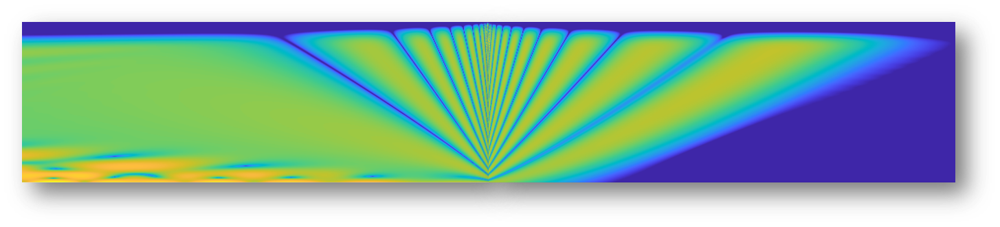

# Wide Angle Parabolic Equation model with arbitrary Mach number

The WAPE model proposed here is an implementation of the work of [Ostashev et al 2020]. The WAPE is developed using a Padé(1,1) series expansion. A Crank-Nicholson algorithm is used to reduce the equation into a matrix system. Then, the 2D acoustic pressure field is calculated using a second-order centered finite difference scheme on velocity potential.

This code is intended to be shared with the research community.

## Installation
This WAPE model is designed to run with [Matlab](https://www.mathworks.com/products/matlab.html), without any additonal toolbox.

## Run a calculation
To run a calculation you need to open "initialisation_WAPE.m", set parameters values, and run the script. It is indicated which parameter can be modified and which can not.

## Post-processing
When the simulation has completed there will be 'DeltaL.mat' and  'normalized_SPL.mat' files which correspond respectively to attenuation to free field (dB) and sound pressure level field (dB) normalized by the maximum amplitude. You can post-process these signals to your liking. 

## Warning
Instabilities can occur with PE simulations if:
- the spatial steps are too large,
- the absorbent layer at the top of the domain is not thick enough.

Calculation time can be really long and take a lot of memory if: 
- the spatial steps are too small,
- the domain is too big,
- the frequency is too high.

## License
This code is released under the EUPL license.

## Credits
The development of this code took part into the french [PIBE project](https://www.anr-pibe.com/) (contract ANR-18-CE04-0011).

## Citing this work
If this WAPE script contributes to an academic publication, please cite it as:

      @misc{kayser2023wape,
        title = {WAPE model},
        author = {Bill Kayser},
        note = {https://github.com/bkayser13/WAPE/},
        year = {2023}
      }

## Some background references

This code largely implements algorithms that have already been published. A non-exhaustive list is proposed below.

Tappert, F. D. (1977). The parabolic approximation method. Wave propagation and underwater acoustics, 224-287.

Gilbert, K. E., & White, M. J. (1989). Application of the parabolic equation to sound propagation in a refracting atmosphere. The Journal of the Acoustical Society of America, 85(2), 630-637.

West, M., Gilbert, K., & Sack, R. A. (1992). A tutorial on the parabolic equation (PE) model used for long range sound propagation in the atmosphere. Applied Acoustics, 37(1), 31-49.

Collins, M. D. (1993). A split‐step Padé solution for the parabolic equation method. The Journal of the Acoustical Society of America, 93(4), 1736-1742.

Ostashev, V. E., Juvé, D., & Blanc-Benon, P. (1997). Derivation of a wide-angle parabolic equation for sound waves in inhomogeneous moving media. Acta Acustica united with Acustica, 83(3), 455-460.

Dallois, L., Blanc-Benon, P., & Juvé, D. (2001). A wide-angle parabolic equation for acoustic waves in inhomogeneous moving media: Applications to atmospheric sound propagation. Journal of Computational Acoustics, 9(02), 477-494.

Lihoreau, B., Gauvreau, B., Bérengier, M., Blanc-Benon, P., & Calmet, I. (2006). Outdoor sound propagation modeling in realistic environments: Application of coupled parabolic and atmospheric models. The Journal of the Acoustical Society of America, 120(1), 110-119.

Cheinet, S. (2012). A numerical approach to sound levels in near-surface refractive shadows. The Journal of the Acoustical Society of America, 131(3), 1946-1958.

Kayser, B., Gauvreau, B., & Ecotière, D. (2019). Sensitivity analysis of a parabolic equation model to ground impedance and surface roughness for wind turbine noise. The Journal of the Acoustical Society of America, 146(5), 3222-3231.

Ostashev, V. E., Muhlestein, M. B., & Wilson, D. K. (2019). Extra-wide-angle parabolic equations in motionless and moving media. The Journal of the Acoustical Society of America, 145(2), 1031-1047.

Ostashev, V. E., Wilson, D. K., & Muhlestein, M. B. (2020). Wave and extra-wide-angle parabolic equations for sound propagation in a moving atmosphere. The Journal of the Acoustical Society of America, 147(6), 3969-3984.
